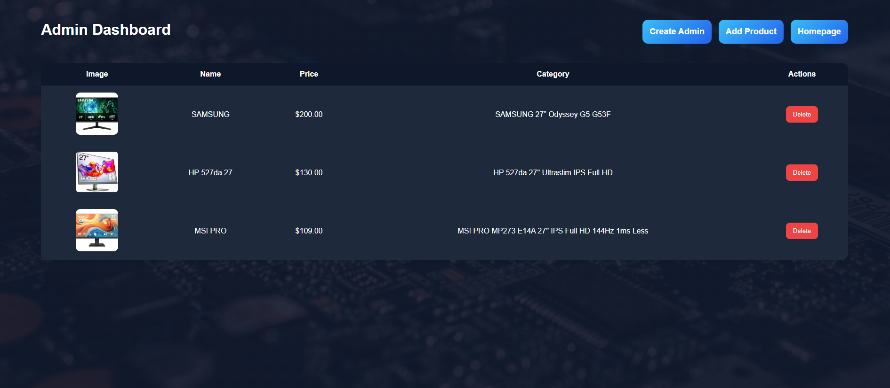

# 🛒 Electro Store

A web-based electronic store management system developed using PHP, MySQL, HTML, CSS, and JavaScript.

---

## ✨ Features

- 🔐 Admin Login
- ➕ Add Products
- ❌ Delete Products
- 📄 View Product Details
- 🖼 Upload Product Images

---

## 🛠 Technologies Used

- PHP
- MySQL
- HTML5
- CSS3
- JavaScript

---

## 📸 Screenshots

### 🏠 Home Page


---

### 🔑 Admin Dashboard



---

### ➕ Add Product


---

### 📄 Product Details


---

## 🚀 Installation

1. Clone the repository.
2. Copy the project to the `htdocs` folder.
3. Import the `electro_store.sql` database.
4. Start Apache and MySQL.
5. Open the project in your browser.

---

## 📁 Project Structure

```
Electro-Store
│
├── screenshots/
├── uploads/
├── add_product.php
├── admin.php
├── admin_login.php
├── create_admin.php
├── db.php
├── delete_product.php
├── electro_store.sql
├── index.php
├── product.php
├── script.js
└── style.css
```

---

## 👨‍💻 Author

**Abdalwahab Al-Qatoneh**

GitHub: https://github.com/Abedulwahab
